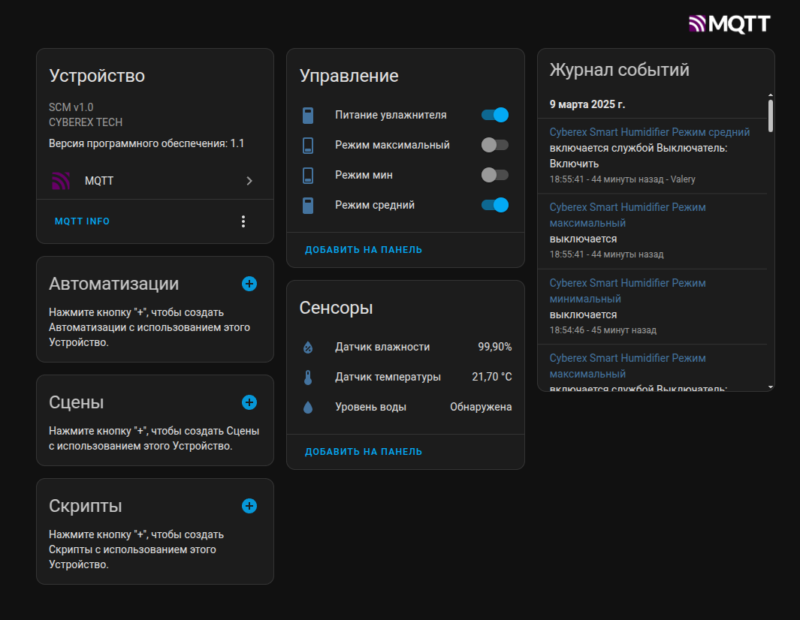

# Модуль для управления увлажнителем с возможностью интеграции в Home Assistant

Разработан для увлажнителей Deerma Humidifier DEM-F628S / DEXP HD-440

## Скриншот автоматического определения устройства с помощью MQTT Auto Discovery 

## Полное описание проекта смотрите на Хабре

- [Описание проекта](https://habr.com/ru/articles/785252/)
